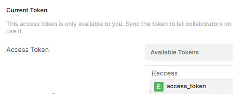

# OpenAPI

## Swagger UI

Run Swagger UI locally and automatically load a predefined OpenAPI document with validation disabled (validation calls a remote service).

```bash
run -it -p 8080:8080 -v netiq-idm-rest-curl-jq/openapi/idmprov/swagger.json:/usr/share/nginx/html/swagger.json --name swagger-ui -e SWAGGER_JSON=/usr/share/nginx/html/swagger.json -e VALIDATOR_URL=none  swaggerapi/swagger-ui:v3.51.1
```

## IdentityApps (aka UserApp or IDMProv)

- OpenAPI spec
- Python script to fix errors in OpenAPI spec
- Postman collection and sample environment

## OSP

- Postman collection and sample environment

## Postman

To enable automatic token refresh after importing a Postman collection and environemnt, edit the collection and set Authorization -> Current Token -> Access Token to `{{access_token}}`:

